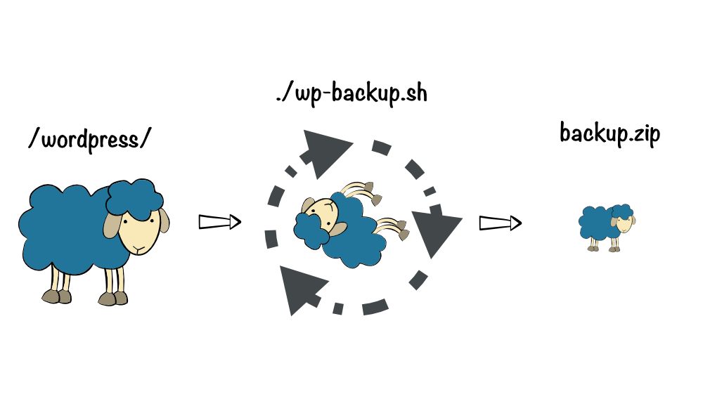

<h2 align="center">
Simple script to manage WordPress backups in pure Bash
</h2>



Create **backups or restore on your WordPress** using a **simple script in Bash** so as not to depend on plugins or WP-CLI.

- Easy.
- Very fast.
- Multi-site compatible.
- Docker compatible.
- Working with cron and any unix utility.
- Maintains settings, plugins and any important elements.
- Compatible with Linux, MacOS and BSD.

## Use

### ⬇️ 📁 ➕ ⬇️ 📓 Backup 

Create a zip file with important files and backup of the database.

``` shell
./wp-backup.sh backup-all
```

### ⬇️ 📓 Backup only database 

``` shell
./wp-backup.sh backup-database
```

### ⬇️ 📁 Restore only files 
 
``` shell
./wp-backup.sh restore-files [{backup}.zip]
```

### ⬆️ 📓 Restore only database

``` shell
./wp-backup.sh restore-database [{database}.sql]
```

### ⬆️ 📁 ➕ ⬆️ 📓 Restore files and database 

``` shell
./wp-backup.sh restore-all [{backup}.zip]
```

### ✅ 📓 Check the connection to the database 

``` shell
./wp-backup.sh check-database
```

### 🔌 📓 Connection to the database

``` shell
./wp-backup.sh connect-to-database
```

## Requirements 

- **bash** 4.0 or higher
- **curl**
- **zip**
- Only macOS users, **gsed**: `brew install gnu-sed`

## Install

Go to the WordPress directory (Where are all the files and folders like wp-admin, wp-config, wp-content ...).

``` shell
cd wordpress-folder
```

Download script.

``` shell
curl -o wp-backup.sh https://raw.githubusercontent.com/tanrax/wp-backup/master/wp-backup.sh
```

Grant execute permissions.

``` shell
sudo chmod +x wp-backup.sh
```

Run.

``` shell
./wp-backup.sh
```

## Are you using Docker?

Enter the container with bash. For example `wordpress_web_1`.

``` shell
docker exec -it wordpress_web_1 bash
```

You will need to enter the WordPress container and install a minimum of unix commands.

- `zip`
- `unzip`
- `mariadb-client`

``` shell
apt update && apt install -y mariadb-client zip unzip
```

It is recommended that you run `wp-backup.sh` inside.

``` shell
./wp-backup.sh
```

## Disclaimer

The author is not responsible for any loss of information or side effects. Use at your own risk.
